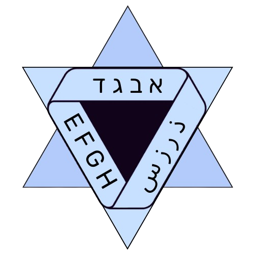

<head>
  <link href='https://fonts.googleapis.com/css?family=Rubik' rel='stylesheet' type='text/css'>
  <title>Israeli Linguistics Olympiad</title>
  <link rel="icon" type="image/x-icon" href="images/LingIsraelLogo.png">
  

</head>

<a href="https://forms.gle/4qVdj4i2BcnpYNht9"><button name="button" class="button">
Register for IsrLO-2024/2025 now!
</button></a>
<a class="hebrew" href="https://forms.gle/4qVdj4i2BcnpYNht9"><button name="button" class="button">!הרשמה לאב״י תשפ״ה</button></a>

#  Israeli Linguistics Olympiad
The national linguistics competition for high school students in Israel. Each year, 4 best students nationwise are selected to represent Israel as a team at the International Linguistics Olympiad.

<!--<a href="./english"><button name="button" class="button">Continue in English</button></a>-->

<h1 class="hebrew">
  
  אולימפיאדת הבלשנות הישראלית
</h1>

  תחרות לאומית בבלשנות לתלמידי.ות תיכון בישראל. כל שנה 4 הזוכים באולימפיאדה מייצגים את ישראל כנבחרת באולימפיאדת הבלשנות הבינלאומית.

<!--

<a class="hebrew" href="./hebrew"><button name="button" class="button">להמשיך בעברית</button></a>

-->

## 1st IsrLO (2024/2025)
The first olympiad is taking place this academic year, 2024/2025.

| Stage     | Dates                  |Place    | Results                                           |
| :---------| :--------------------- |:--------| :-----------------------------------------------: |
| 0         |  4.05.2024             |online   | <a href="https://israel-ling.org/olimpiada" target="_blank">➲</a> |
| 1 (aleph) |  1.11.2024 – 2.11.2024 |online   |                          |
| 2 (bet)   |  February 2025         |in person|    |

The four winners of this olympiad will represent Israel as a team at
<a href="https://ioling.org/upcoming" target="_blank">IOL-2025 in July in 🇹🇼 Taiwan</a>.

<a href="https://forms.gle/4qVdj4i2BcnpYNht9"><button name="button" class="button">Register</button></a>

<h2 class="hebrew"> אב״י הראשונה (תשפ״ה) </h2>

האולימפיאדת הראשונה מתקיימת בשנת הלימודים הזו, תשפ״ה (2024/2025).

| שלב        | תאריכים                 | מיקום    | תוצאות                                            |
| ----------:| -----------------------:| -------: | :-----------------------------------------------: |
| 0          |  4.05.2024               | אונליין    | <a href="https://israel-ling.org/olimpiada" target="_blank">➲</a> |
| א   |  1.11.2024 – 2.11.2024   | אונליין    |                         |
| א   |  פברואר 2025             | פרונטלי |    |

  ארבעה המנצחים באולימפיאדה יהיו בנבחרת שתייצג את ישראל <a href="https://ioling.org/upcoming" target="_blank">באולימפיאדה הבינלאומית ביולי 2025 🇹🇼 בטאיוואן</a>.

<a class="hebrew" href="https://forms.gle/4qVdj4i2BcnpYNht9"><button name="button" class="button">הרשמה</button></a>

